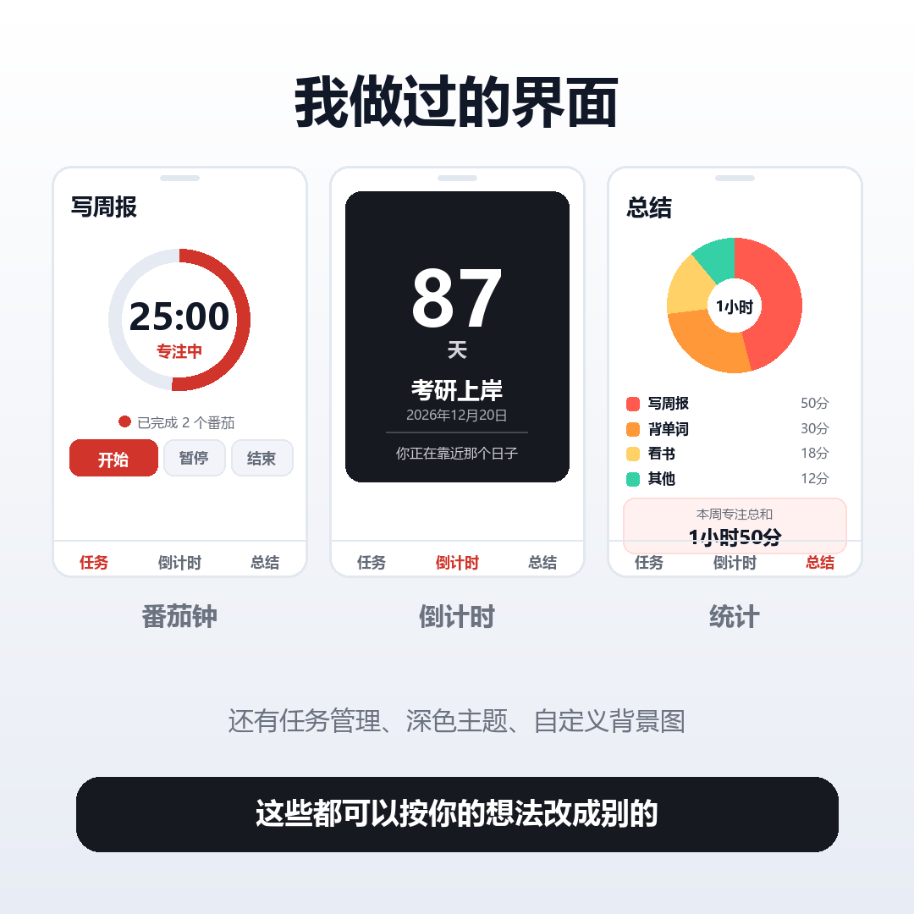

<p align="center">
  
</p>

<h1 align="center">一刻</h1>

<p align="center">
  一个极简的番茄钟 App ｜ 不联网 · 不注册 · 不收集任何数据
</p>

<p align="center">
  
</p>

---

## 它是什么

一个用来专注的计时工具，同时带考试 / 纪念日倒计时。

打开就能用，不用注册、不用登录、不用联网。所有记录只存在你自己的手机里。

> **「一刻」** = 一刻钟，也 = 专注这一刻。

---

## 功能

**番茄钟**
- 专注 / 短休息 / 长休息三段循环，轮数可配置
- 计时用的是「结束时间戳」，切后台、锁屏、重开 App 时间都准
- **到点提醒**：退到后台、甚至划掉 App，照样响铃 + 震动
- 专注结束可自动进入休息（可关）

**任务**
- 加任务、改名、删除、标记完成
- **每个任务能单独设时长** —— 背单词 15 分钟，写代码 45 分钟
- 每天自动翻新，历史记录保留

**倒计时**
- 可以加多个重要日子，显示剩余天数
- 能从相册选背景图（自动压缩后保存）
- 每天自动换一句鼓励文案（内置 59 句），也能写自己的
- 到期当天显示「就是今天」，过期后显示「已过去 N 天」

**统计**
- 按任务名统计专注时长，**扇形图 / 横向条形图**随意切换
- 今日 / 本周 / 总计，也能指定任意日期
- 显示专注总和、任务数、番茄个数

**个性化**
- 深色 / 浅色 / 跟随系统
- 可以换整个 App 的背景图
- 全部配色都做过对比度校验（两种主题都 ≥ 4.5:1）

**数据**
- 完全离线，不联网、不上传
- 导出 / 导入备份（一段文本，发微信、存备忘录都行）
- 支持系统自动备份与换机迁移

<p align="center">
  
</p>

---

## 下载

**安卓**：[Releases](../../releases) 里下载 `一刻.apk` 直接安装。

**iPhone / 电脑**：打开网页版

```
https://lin428924379.github.io/yike/
```

在 Safari 里点「分享 → 添加到主屏幕」，看起来和 App 一样。

> ⚠️ 网页版在 iPhone 上有个限制：**切到后台或锁屏后，到点不会响**。
> 因为 iOS 会冻结后台网页，而网页没法自己往系统里排闹钟。
> 安卓版没这个问题（写了原生插件）。

---

## 为什么图标是一圈四分之三

「一刻」= 一刻钟 = 四分之一小时。

所以图标就是一个完整的环，四分之一是红的 —— 既是「计时器走到四分之一」，
也是「从时间里取走一刻」。

<p align="center">
  
  <br>
  <sub>图标改过的六个版本</sub>
</p>

---

## 项目结构

```
focus/index.html          整个 App（单文件，HTML + CSS + JS，约 2900 行）
docs/index.html           公开的网页版（自动生成，别直接改）
docs/privacy.html         隐私政策
images/                   README 用的图
tools/make_web_version.mjs        由 focus/index.html 生成 docs/index.html
tools/check_focus.mjs             70 项自动检查
tools/make_android_icons.py       生成安卓图标和启动画面
assets-src/                       图标的原始图片
android-app/                      安卓打包工程（Capacitor）
```

---

## 想自己改

改 `focus/index.html` 就能改掉所有界面和逻辑 —— 它是单文件，浏览器直接打开就能看到效果。

```bash
# 改完之后跑一遍检查（70 项）
node tools/check_focus.mjs

# 重新生成公开的网页版
node tools/make_web_version.mjs

# 打包安卓（需要 Android SDK + JDK 21）
cd android-app
npm install
npx cap sync android
cd android && gradlew.bat assembleDebug
```

`tools/check_focus.mjs` 里的 70 项检查包括：用 `vm` 把纯逻辑抽出来跑一遍、
检查每个按钮有没有接上函数、检查所有元素 id 是否真的存在、
检查有没有外部 URL、检查 CSS 有没有用老手机不支持的特性，
以及把整段脚本用 `new Function()` 解析一遍
（最后这条抓到过一次致命的重复声明 —— 整段脚本直接不执行）。

---

## 技术说明

- 界面用网页技术（HTML / CSS / JS），外壳用 **Capacitor** 套的安卓原生壳
- 为了让网页真正铺满全屏并正确让开系统栏，写了个原生插件
  （`android-app/android/app/src/main/java/com/tomato/focus/ShellPlugin.java`）
- 到点提醒走安卓原生闹钟（AlarmManager），所以退到后台也能响
- 通知的铃声和震动挂在**通知通道**上，通道由原生插件创建
- CSS 刻意避开了 2019 年之后才有的特性（`inset`、`aspect-ratio`、flex `gap` 等），
  让 2017 年以后的老手机也能正常显示

---

## 声明

个人项目，未添加开源许可证（保留所有权利）。
